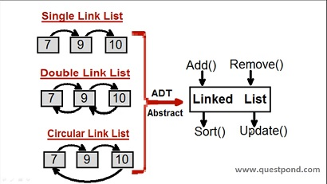
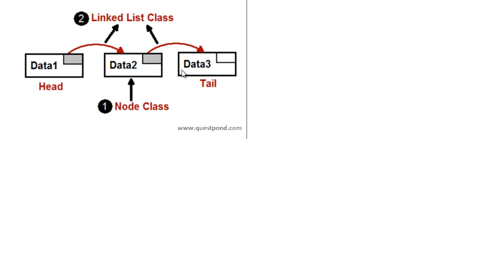

# LINK LIST

### Link List - ADT(Abstact Data Type)
Its represent where family of data structure, Where linear and sequential way  
Link List have elements/nodes  
Node have Data and Pointer  

 

### Famous Implementation
- Simple/Single - Have nodes and one node points towards to next node. Just have one way pointer.
- Double - One node points towards to next node also points towards to previous node. Traves front and back very easily.
- Circular - Ever nodes points to next node. But last node point to first node. 
   - Types - Simple Circular, Double Circular

